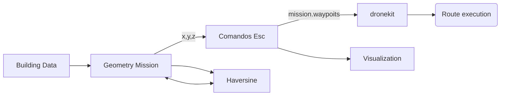

# Mission generator for building evaluation with UAS

This project belong to the final degree project developed by Marc Vila during his Bsc. Aerospace Engineering at UPC, which involved designing and development of a library to generate and send UAS flight paths using the *dronekit* library to be used as a tool for building evaluations.

The project uses a combination of classic geometry and calculus techniques to generate cartesian data points [x,y,z] of the route arround a fictional building using the input data of the building size and geometry, then using a set of *Haversine* equations the cartesian point are transtaled into coordinates [Latitude, Longitude, Altitude] to be writen as *ArduPilot flight plan format. Then as a final step, using the *dronekit library it is sent via *Mavlink to the execution of the mission and data collection.

Full report on the project with detail description on how the data is generated and calculated can be found at the official [UPC repository](https://upcommons.upc.edu/handle/2117/327793) for alumni Bsc. final projects.

## Functions 

- *haversine.py* : set of functions which contain the haversine equations to transform cartesian points into coordinates
- *droneCommands.py* :
- *missionCalculation.py* :
- *routes.py* :
- *plotroutes.py* : Small script to visualize the route genereted arround the input building
- *facadeMission.py* :
- *helixMission.py* :
- *multifacadeMission.py* :
- *demo.py* : 

## Structure

## Examples

Various examples developed using BEMS library:

© UPC Universitat Politècnica de Catalunya · BarcelonaTech, 2020 ™
