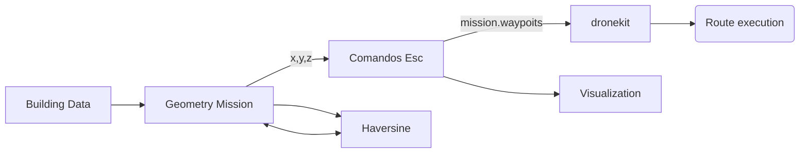

# Mission generator for building evaluation with UAS

This project belong to the final degree project developed by Marc Vila during his Bsc. Aerospace Engineering at UPC, which involved designing and development of a library to generate and send UAS flight paths using the *dronekit* library to be used as a tool for building evaluations.

The project uses a combination of classic geometry and calculus techniques to generate cartesian data points [x,y,z] of the route arround a fictional building using the input data of the building size and geometry, then using a set of *Haversine* equations the cartesian point are transtaled into coordinates [Latitude, Longitude, Altitude] to be writen as *ArduPilot flight plan format. Then as a final step, using the *dronekit library it is sent via *Mavlink to the execution of the mission and data collection.

BEMS library (Building Evaluation Mission Systems) can be used to generate different missions depending on the buidling shape/geometry or type of mission desired :
- Square.
- Helix.
- Circle.
- Facade.
- Multi floors.

Full report on the project with detail description and examples on how the data is generated and calculated can be found at the official [UPC repository](https://upcommons.upc.edu/handle/2117/327793) for alumni Bsc. final project.

## Functions 

- *haversine.py* : Set of functions which contain the haversine equations to transform cartesian points into coordinates
- *droneCommands.py* : Set of commands to establish comunication and send commsnds to the UAV using *dronekit* (arming, writing mission, status check,...)
- *missionCalculation.py* : Set of functions that write the mission generated into *ArduPilot* mission format file. 
- *routes.py* : Set of functions that generate the mission points on cartesian coordinates based on building data.
- *plotroutes.py* : Small script to visualize the route genereted arround the input building.
- *facadeMission.py* : Generates sample facade mission for testing.
- *helixMission.py* : Generates sample helix mission for testing.
- *multifacadeMission.py* : Generates sample multi facade mission for testing.
- *demo.py* : Full demo used during the project presentation that contains simple UI to generate and run different missions.

## Structure

## Examples

Various examples developed using BEMS library, visualized with *Google Earth* and *Mission Planner*:

Facade Mission

Multi Square Mission

Circle Mission

© UPC Universitat Politècnica de Catalunya · BarcelonaTech, 2020 ™
