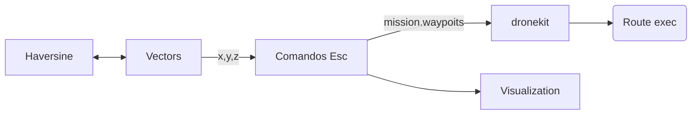

# Mission generator for building evaluation with UAS

on the way

## Functions 

- asdasd.py :
- asdasd.py :
- aaaaa.py :

## Structure

© UPC Universitat Politècnica de Catalunya · BarcelonaTech, 2020 ™
