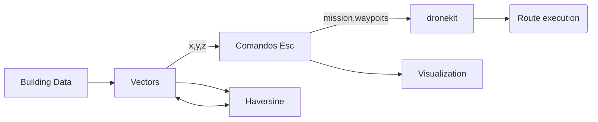

# Mission generator for building evaluation with UAS

This project belong to the final degree project developed by Marc Vila during his Bsc. Aerospace Engineering at UPC, ....

** link report ** 

## Functions 

- _haversine.py :
- _droneCommands.py :
- _missionCalculation.py :
- _routes.py :
- _plotroutes.py :
- _facadeMission.py :
- _helixMission.py :
- _multifacadeMission.py
- _demo.py :

## Structure

## Examples

Various examples developed using BEMS library:

** include photos ** 

© UPC Universitat Politècnica de Catalunya · BarcelonaTech, 2020 ™
